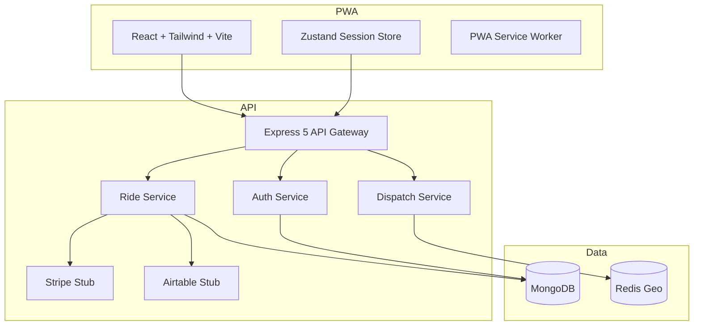

# Architecture Overview

## Backend

- **Express 5** with modular routers for auth, rides, drivers, and health checks.
- **MongoDB / Mongoose** store riders, drivers, and ride lifecycles.
- **Redis geospatial** cache for active driver positioning with an in-memory fallback for local development.
- **Service layer** encapsulates dispatch, payment, and analytics integrations (Twilio, Stripe, Airtable stubs).
- **Security** via JWT access tokens, refresh rotation, Joi validation, Helmet, and rate limiting.

## Frontend

- **React + Vite PWA** with Tailwind for rapid UI and mobile-first styling.
- **Zustand** manages session tokens for API authentication.
- **Leaflet** renders pickup/dropoff markers on OpenStreetMap tiles.
- **Service worker** precaches offline screen and registers install prompts.

## Testing

- Backend: Jest unit + integration suites with mongodb-memory-server and Supertest.
- Frontend: Jest + React Testing Library component coverage.

## CI/CD

GitHub Actions pipeline installs workspaces, runs lint + tests, and builds the PWA artifact. Extend the deployment job to publish
Docker images and trigger hosting platform deploys.
